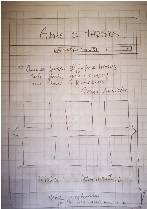
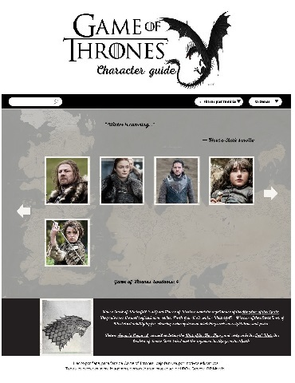
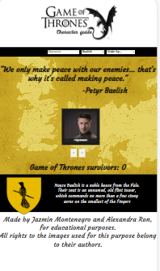
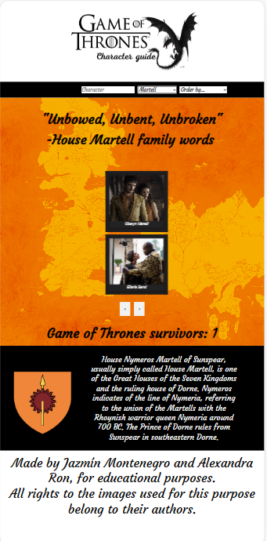
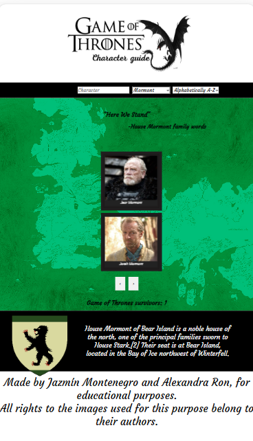
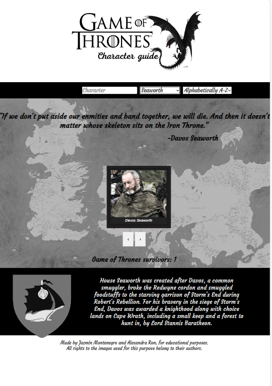
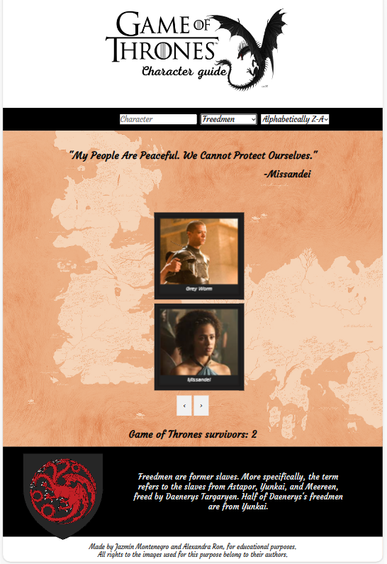

# Game of Thrones

"Juego de Tronos" es una serie de televisión de drama y
fantasía épica creada por David Benioff y D.B. Weiss,
basada en la serie de novelas "Canción de Hielo y Fuego"
del autor George R.R. Martin. La serie sigue las luchas y
conflictos entre varias casas nobles en el ficticio continente
de Westeros, mientras compiten por el Trono de Hierro y el
control de los Siete Reinos.

## Hallazgos

Haciendo una investigación (research) sobre la
información que podrían necesitar nuestras
usuarias encontramos que los datos de mayor
interés son:

- Información sobre los personajes como nombre,
titulo, imagen y famila

Adicionalmente a esta información, para nuestras usuarias es importante poder
ver la lista de personajes que aparecen en
la serie y la cantidad de miembros en cada familia para
tener mayor información de la serie.

## Detalles de la data

- nombre
- apellido
- titulo
- familia
- imagen
- año de nacimiento
- año de muerte

En el archivo motto.js creado por las programadoras para complementar el diseño:
- Lema familiar o cita de personaje.
- Escudo de la familia
- Breve historia de la familia
## Descripcion del producto y su Diseño
Bautizamos el website como "Game of Thrones: Guía de personajes", debido a que la mayor parte de la información que teníamos disponible, solo incluía este aspecto de la Saga literaria.
Tratamos de darle un diseño parecido a los juegos de mesa de la franquicia;  El background muestra el mapa de Westeros, sobre el que se depositan  las cartas de los personajes, como si del tablero de juego se tratara.
Cada pantalla es capaz de mostrar 12 cartas. Para cambiar de pantalla solo hay que accionar los botones de paginación en la parte inferior de la misma.
Las 53 tarjetas de personaje son negras,  y contienen la foto del personaje por su parte delantera, e información personal por el reverso; revelandose una vez el usuario coloca el cursor encima de cada una de ellas.  Esta información incluye: el titulo que obstentaba, a qué familia pertenecía y su año de nacimiento.
 En la parte inferior del tablero,  se deposita información adicional sobre la historia de la franquicia, o  los personajes que están visibles en ese momento en pantalla.
 En el footer, nos pareció necesario colocar un disclaimer sobre los derechos de autor de los personajes e imagenes utilizadas, para evitar problemas a futuro.

## Funcionalidades

  Hemos agregado 4 funcionalidades principales a la página, a saber:
  1. Función de Búsqueda.
    Disponible en el navegador principal, a través de un campo de busqueda o input.
     El usuario puede escribir el nombre del personaje que necesite en el campo, y el sistema solo mostrará en pantalla esa card.
    En el código: activamos la función con un evento keyup, de manera que la busqueda se da a la par que el usuario escribe.
2.  Función de Filtrado:
    Disponible en el navegador principal a través de un selector.
    Es la que más cambios realiza en el tablero, dependiendo de la casa escogida:
    - El background cambia a los colores tradicionales de la casa.
    - Se muestra una cita, asociada a uno, o a todos los personajes de la casa. En el área superior del tablero.
    - Se muestran solo las tarjetas con los personajes pertenecientes a esa casa.
    - Se muestra el escudo de la casa, en el panel inferior del tablero.
    - Se muestra una pequeña historia de la familia, en el panel inferior del tablero.
    - y se activa la función "Sobrevivientes", que permite conocer cuántos personajes sobrevivieron de esa casa, al juego de Thronos.
3. Función de Ordenado Alfabetico:
    Disponible en el navegador principal a través de un selector.
    Ofrece la oportunidad al usuario de ordenar alfabeticamente la data de forma ascendente o descendente.
4. Función Sobrevivientes:
    Disponible en todas las pantallas del website. En la parte baja del tablero.
    Genera una operación matemática que imprime numéricamente, cuantos de los personajes mostrados en pantalla sobrevivieron al Juego de Tronos, al terminarse la serie.
    En el código: se realizó tomando en cuenta la presencia o no de una fecha de muerte, en la data por personaje.

# test 

Se reañizaron 12 test con el proposito de verificar y validar el funcionamiento del codigo de data.js, son una parte esencial del codigo ya que nos permiten detectar errores antes de llevarlos a produccion, para este proyecto se realizaron al rededor de 12 test el resultado fue:

File          | % Stmts | % Branch | % Funcs | % Lines | Uncovered Line #s                                                       
--------------|---------|----------|---------|---------|-------------------
All files     |   96.96 |    76.92 |     100 |   96.55 | 
 src          |   96.96 |    76.92 |     100 |   96.55 | 
  data.js     |   96.96 |    76.92 |     100 |   96.55 | 37
 src/data/got |       0 |        0 |       0 |       0 | 
  motto.js    |       0 |        0 |       0 |       0 | 
--------------|---------|----------|---------|---------|------------------- 

donde se evaluo:

1. funciones 
2. lo que retorna una funcion
3. si es un objeto
4. fitrado desde la data original y su resultado
5. condiciones 
6. ciclos 
7. operaciones 

#prototipo de baja fidelidad

# prototipo de Alta fidelidad

#Demas Prototipos

#  filtrado de datos

# buscado de Imagenes

# contador

# Interfaz primaria

